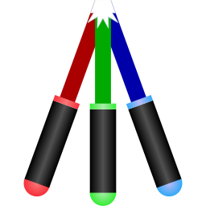

# &nbsp;HoloControl

## Obsah
- [ HoloControl](#holocontrol)
  - [Obsah](#obsah)
  - [Úvod](#úvod)
  - [Rychlý manuál](#rychlý-manuál)
    - [Ovládání fyzickými tlačítky v manuálním režimu](#ovládání-fyzickými-tlačítky-v-manuálním-režimu)
    - [Ovládání fyzickými tlačítky v automatickém režimu](#ovládání-fyzickými-tlačítky-v-automatickém-režimu)
  - [Zapojování elektronického obvodu](#zapojování-elektronického-obvodu)
  - [Zdrojový kód](#zdrojový-kód)

## Úvod
Sada HoloControl slouží k řízení laserových zdrojů pro účely holografie. Skládá se z programu pro Raspberry Pi Pico pro samotné řízení, elektronického obvodu pro napájení, indikaci a ovládání a (semi-)grafického rozhraní pro Windows a Android.

Tato sada byla vytvořena v rámci studentského projektu na MFF UK pro zjednodušení holografického experimentu.

## Rychlý manuál
> Předpokládá se, že již máte nainstalovanou aplikaci _HoloControl_ na svém zařízení. Pokud ne, můžete ji stáhnout [zde](https://update.mciesla.cz/HoloControl).
1. Připojte USB kabel z experimentu do svého zařízení
2. Zapojte zásuvkový adaptér z experimentu do elektrické sítě  
   > [!IMPORTANT]
   > Pořadí je zde důležité: Pokud zapojíte experiment do elektrické sítě dříve, než do svého počítače, všechny lasery se zapnou, což může přinést riziko osvícení intenzivním laserovým zářením.
3. Spusťte aplikaci _HoloControl_ na svém zařízení
4. Vlevo nahoře vyberte port, na kterém je experiment připojen, a klikněte na tlačítko připojit.  
   > [!TIP]
   > Pokud nevíte, na kterém portu je experiment připojen, můžete buďto aplikaci spustit před připojením experimentu ke svému zařízení a sledovat, který port přibyl, nebo postupně porty v seznamu vyzkoušet. Aplikace vždy nejprve ověří, zda se na daném portu nachází mikropočítač s programem k experimentu.
5. V konzoli aplikace se zobrazí informace o připojení a nad konzolí se změní stav připojení. V dolní části konzole se aktivuje modré tlačítko _Odeslat_.
6. Pomocí prvních tří možností zkontrolujte současné nastavení experimentu.  
   > [!NOTE]
   > Tlačítka pouze přidávají příkazy do vstupního pole konzole, klikněte na modré tlačítko pro jejich odeslání do experimentu.
7. Přepněte experiment do požadovaného režimu (automatický/manuální) fyzickým přepínačem na experimentu. Informace o ovládání fyzickými tlačítky jsou uvedeny níže. Dále jsou uvedeny kroky pro ovládání automatického režimu.
8. Nastavte požadované časy expozice v jednotlivých barvách. Nejprve vpiště hodnotu do pole vpravo, poté klikněte na tlačítko s názvem příkazu. Kliknutím na každé tlačítko se opět pouze vloží příkaz do vstupního pole konzole, odešlete (i více příkazů najednou) kliknutím na modré tlačítko.
   > [!WARNING]
   > Časy expozice se nastavují podle citlivosti holografické desky v dané barvě udané výrobcem a naměřeného výkonu laseru. K této kalibraci se využívá manuální režim.

   Můžete také nastavit čas čekání před zahájením expozice a čas dosvěcování holografické desky po dokončení expozice lasery.
9. Pokud délka USB kabelu umožňuje, abyste se svým zařízením stále připojeným opustili místnost s experimentem, můžete expozici zahájit odesláním příkazu z aplikace. Pokud ne, zhasněte displej svého zařízení (neodpojujte od experimentu!) a expozici můžete zahájit stisknutím kulatého bílého fyzického tlačítka na experimentu.  
   > [!NOTE]
   > Experiment má zabudovaný bzučák, který je spuštěn vždy na začátku a konci expozice. Bzučí při zahájení čekací doby, při zapnutí laserů, při vypnutí laserů a při vypnutí dosvětlovací světelné diody.
10. Expozice doběhne plně automaticky s nastavenými časy. Pokud potřebujete expozici přerušit, použijte kulaté bílé fyzické tlačítko nebo z aplikace odešlete příkaz. Můžete expozici buďto pozastavit (stisknutím tlačítka) nebo zrušit (podržením tlačítka alespoň $2\,\text{s}$).

### Ovládání fyzickými tlačítky v manuálním režimu
- 🟨 Čtvercové žluté tlačítko přepíná mezi lasery. Aktuálně spuštěný laser je indikován světelnou diodou vlevo od tlačítka.
- ⚪ Kulaté bílé tlačítko zapíná a vypíná dosvětlovací světelnou diodu. Její stav indikuje samostatná světelná dioda mezi tlačítky.

### Ovládání fyzickými tlačítky v automatickém režimu
- 🟨 Čtvercové žluté tlačítko se nepoužívá.
- ⚪ Kulaté bílé tlačítko pozastavuje a spouští expozici. Podržením tlačítka déle než $2\,\text{s}$ resetuje expozici.

## Zapojování elektronického obvodu
Obvod se skládá ze tří desek plošných spojů spojených čtyřmi kabely.
- Deska s dosvětlovací světelnou diodu se spojuje silným dvoužilovým kabelem zapojeným do svorkovnic. Na hlavní desce je svorkovnice označena `L+`, strana s `+` je kladný pól.
- Deska řídícího panelu je připojena dvěma čtyřžilovými a jedním desetižilovým plochým kabelem. Pokud máte kabely osazené konektory, nejprve zapojte čtyřžilový kabel do obou vidlic označených `Con_SW1A`, poté zapojte zbylé kabely do odpovídajících vidlic. Pokud kabely osazené konektory nemáte nebo si nejste jistí, podívejte se na [schéma zapojení](HoloControl-PCB/README.md).
- Trojice laserů přímo v experimentu se připojuje do svorkovnic označených `R+` (červená), `G+` (zelená) a `B+` (modrá). Strana s `+` opět značí kladný pól.
- Externí laser se připojuje pomocí BNC konektoru koaxiálním kabelem (nebo přechodkou BNC-USB).

> [!CAUTION]
> Všechny napájecí výstupy (`R+`, `G+`, `B+` a `L+`) jsou připojeny na proudové regulátory. Pokud se jedná o novou desku, nebo se v experimentu měnily lasery, je nutné pomocí multimetru připojeného nakrátko do svorkovnice v režimu ampérmetru a plochého šroubováku upravit odpor trimrů, aby regulátory dávaly správný proud a nedošlo k poškození laserů.

## Zdrojový kód
Tento repozitář obsahuje zdrojový kód programu pro mikropočítač Raspberry Pi Pico v experimentu a uživatelské aplikace _HoloControl_ pro pohodlnou komunikaci s mikropočítačem.

Mikropočítač vykonává program napsaný v jazyce C s knihovnou _Pico SDK_ a nachází se v adresáři [HoloControl-Pico](HoloControl-Pico/). Vstupním bodem programu je [`i_holo_control.c::main()`](HoloControl-Pico/i_holo_controller.c#L091).

Uživatelská aplikace _HoloControl_ je napsána v jazyce C# pomocí frameworku _MAUI_ a je v principu dostupná pro platformy Windows, Android, MacOS, iOS a Tizen. V praxi jsou ale platformy MacOS, iOS a Tizen vynechány ze sestavení, jelikož pro ně nebyla poptávka. Platforma Android je sice implementována, ale s dostupnými zařízeními se na ní nepodařilo  odladit fungování sériové komunikace s mikropočítačem &mdash; v praxi je tedy použitelná pouze aplikace pro Windows. Zdrojový kód aplikace je v adresáři [HoloControl-UI](HoloControl-UI/) a vstupním bodem programu je [MauiProgram.cs::CreateMauiApp()](HoloControl-UI/MauiProgram.cs#L009).